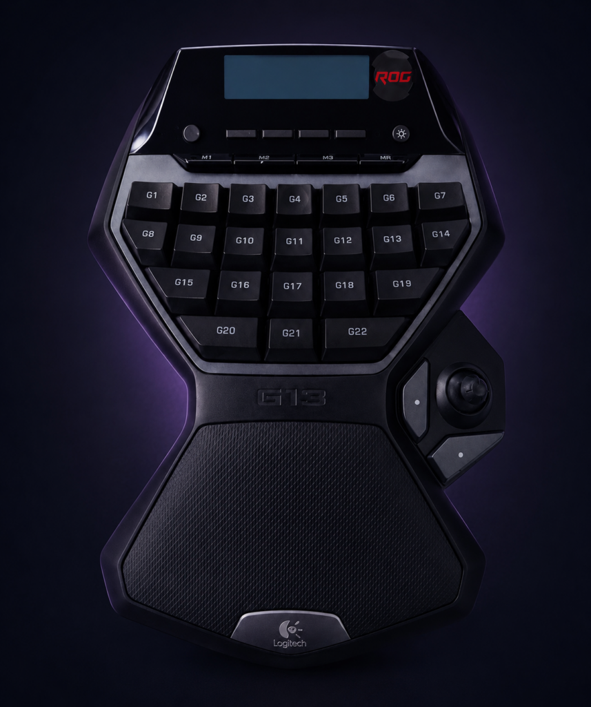
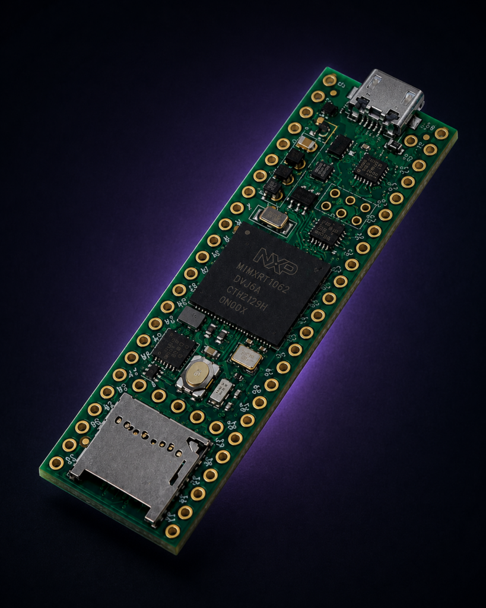
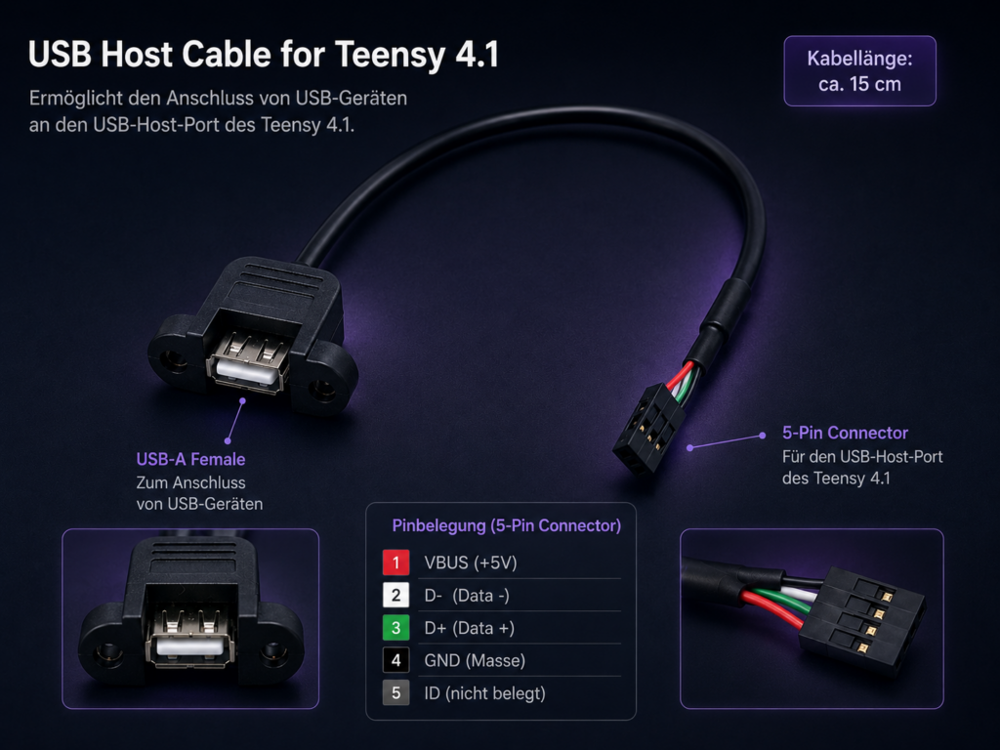
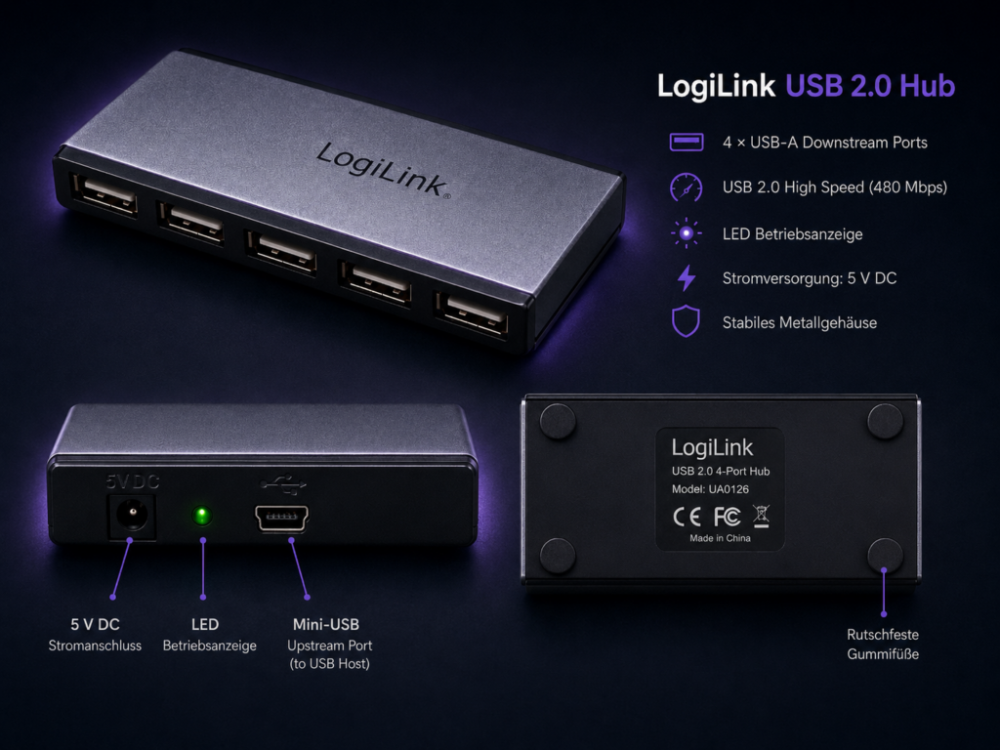
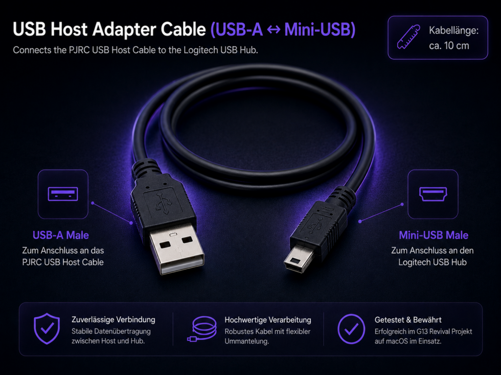
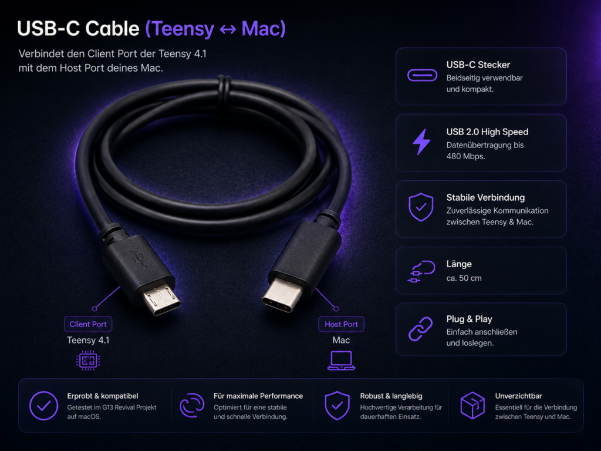
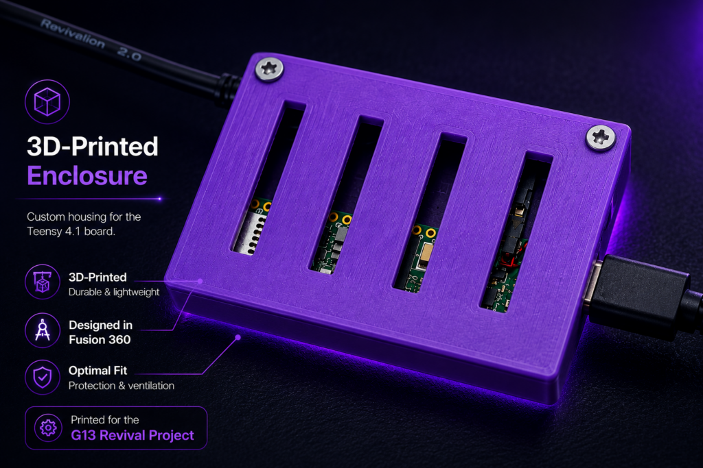

# Required Hardware

## Core components

### Logitech G13 Advanced Gameboard

The original Logitech G13 is the input device handled by the firmware. No
internal modification of the G13 is required.

### Teensy 4.1

The Teensy 4.1 is required because the project uses its independent USB host
and USB device interfaces at the same time.

Official information:
<https://www.pjrc.com/store/teensy41.html>

### PJRC USB host cable

The USB host connector must be attached to the Teensy 4.1 host pads. The
official PJRC cable provides the correct connector and USB-A host socket.

Official information:
<https://www.pjrc.com/store/cable_usb_host_t36.html>

The host pads are small. If you are not experienced with fine soldering, use an
experienced electronics technician or maker service.

### Powered USB 2.0 hub

The verified setup uses a powered USB hub between the G13 and Teensy host
connection. It provides stable power for the G13 and is strongly recommended
for reproducing the tested configuration.

The reference hardware used a LogiLink four-port USB 2.0 hub with an external
power supply and Mini-USB upstream connection.

## Required cables

- USB-A male to Mini-USB Type-B male cable between the PJRC host socket and the
  powered hub upstream port.
- Micro-USB male to USB-C male cable between the Teensy device/client port and
  the Mac used by the reference setup.

Use short, well-shielded cables where practical. Poor cables can cause upload
problems, disconnects or unstable HID communication.

## Optional enclosure

An enclosure protects the Teensy, solder joints and cables from accidental
movement or shorts.

## Electrical caution

- Use only documented USB host and device connections.
- Do not improvise connections to the Teensy host pads.
- Use the power supply intended for the powered hub.
- Confirm that the chosen hub and cable arrangement does not introduce
  unintended USB power backfeeding.
- Disconnect power before soldering or changing the host connection.

