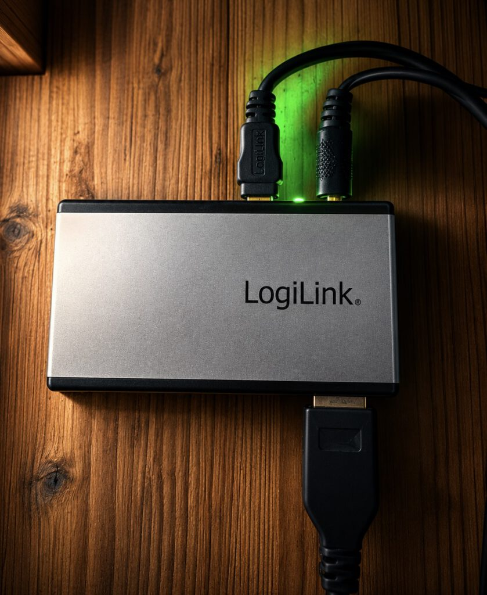
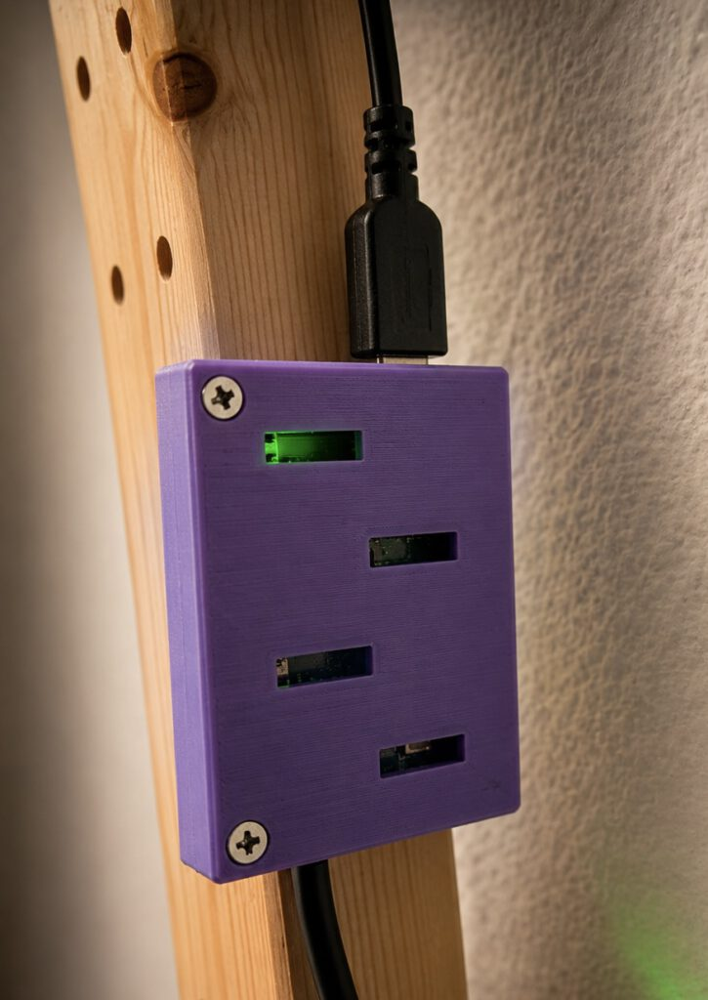
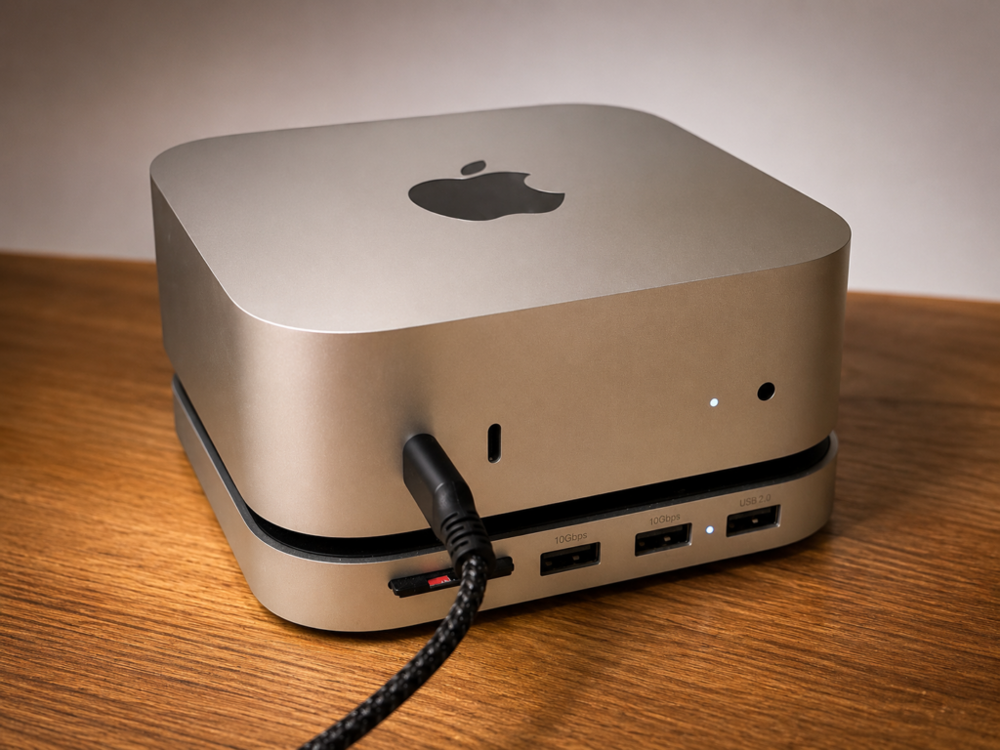
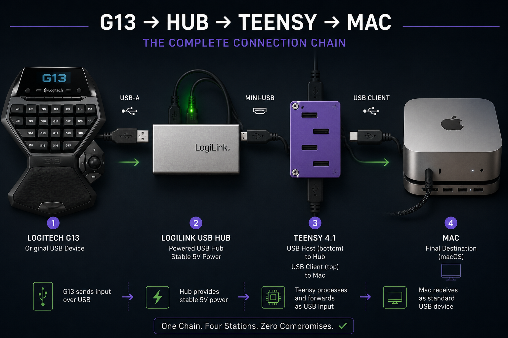

# Wiring Guide

## Signal path

```text
Logitech G13
    |
    | USB cable
    v
Powered USB 2.0 hub
    |
    | Mini-USB upstream port
    | USB-A male to Mini-USB Type-B male cable
    v
PJRC USB host cable
    |
    v
Teensy 4.1 USB host pads

Teensy 4.1 USB device/client port
    |
    | Micro-USB to the computer
    v
Mac or other host computer
```

The G13 remains electrically unchanged. All protocol translation takes place
in the Teensy firmware.

## Connection sequence

1. Attach the PJRC USB host connector to the Teensy 4.1 host pads.
2. Connect the PJRC USB-A host socket to the powered hub's Mini-USB upstream
   port using the USB-A-to-Mini-USB cable.
3. Connect the Logitech G13 to a USB-A device port on the powered hub.
4. Connect the hub's external power supply.
5. Connect the Teensy Micro-USB device/client port to the computer.
6. After the firmware starts, verify the status LED, LCD and G-key mappings.

## Reference photographs

Powered-hub connection:



Teensy host and device connections:



Computer-side connection:



Complete reference setup:



## Important distinction

The two Teensy USB roles must not be confused:

- **USB host:** soldered host pads and PJRC host cable, facing the G13/hub.
- **USB device/client:** the Teensy Micro-USB connector, facing the computer.

